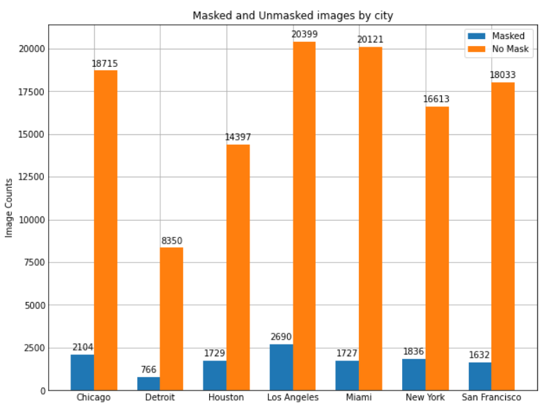

# Social Media Mask Dataset

The Social Media Mask Dataset is a dataset made up of Twitter Images intended for the training of Convalutional Neural Networks to detect masks in images and video. In this case, the term masks refer to a device worn on the face intended to reduce the spread of respiratory illness. Two categories of images exist: "mask" and "no_mask". All efforts were made to ensure each image contains a person and is viable for training CNN models. For more details the makeup of the dataset and the collection process refer to the accompanying paper.   

The initial published version of this dataset can also be found on [Zenodo](https://doi.org/10.5281/zenodo.5813804).

The accompanying paper,along with contact information if you have any questions, can be found on [TODO]().

## Instructions for Download Script Use
Below is a step by step walkthrough on how to succesfully use our download script.

### Before you begin

Before running our script, you need to register for a free Twitter developer account. Instructions for doing so can be found on [Twitter's Developer Website](https://developer.twitter.com/en/docs/twitter-api/getting-started/getting-access-to-the-twitter-api). Once you have an account, you will be assigned a bearer token for the V2 API. Keep it in a safe place for later.

Our script makes use of Bash commands and was developed on Ubuntu Linux. If you are on a Linux System, and are using the Bash kernel (as far as the authors are aware) you should have no operating system issues. If you are on a Windows system, you will need to enable the Linux subystem for Linux. Instructions to do so on a Windows 10 machine can be found [the windows central website ](https://www.windowscentral.com/install-windows-subsystem-linux-windows-10) while Windows 11 instructions are found on the the [pure info tech website](https://pureinfotech.com/install-wsl-windows-11/) (full credit to these guides go to their respective authors).

Ensure you have Python3 installed on your device. Instructions to install Python3 on a linux machine or the linux subsystem on a windows machine can be found on the [Hitch Hikers Guide to Python](https://docs.python-guide.org/starting/install3/linux/). We developed and tested this script using Python 3.8.

### Running the Script
To run our script use the command line to navigate to the directory with `testing.json`, `training.json`, and `download_dataset.py`. Then enter the simple command `python3 download_dataset.py`. The script will then inform ask you if you are ready to continue. If you enter yes, the script will ask for your Twitter bearer token. Copy paste it into the command line with no extra spaces or new lines. Your download should now begin.

## Guide to Understanding the Dataset
Below are annotated examples of dataset entries and a numerical breakdown of the contents of the Social Media Mask Dataset.

### Annotated Examples  
Due to Twitter's TOS, we cannot directly publish Twitter images. Instead, we publish Tweet keys along with information our script uses to download the target image. An Annotated example is shown below.

### Numerical Breakdown
As of summer of 2020, there are 12,482 masked and 116,620 unmasked images, totaling approximately 129,000 images (129,102). A breakdown of Tweets per city and time period (year 2020) are shown in the below table. Following the table, a graph showing information on the number of masked and unmasked images taken from each city is shown. For the purposes of model training, we removed duplicate images. Due to a few images being posted under multiple location tags, there is a 10 image discrepancy between the total images listed above and the sum of the listed table and graph number.

| City          | 04/15 - 06/16 | 9/01 - 11/28 |
|---------------|-------------|--------------|
| Chicago       | 8709        | 12,110       |
| Detroit       | 3387        | 5729         |
| Houston       | 2888        | 13,238       |
| Los Angeles   | 7752        | 15,337       |
| Miami         | 6680        | 15,168       |
| New York      | 5650        | 12,799       |
| San Francisco | 9050        | 10,615       |

